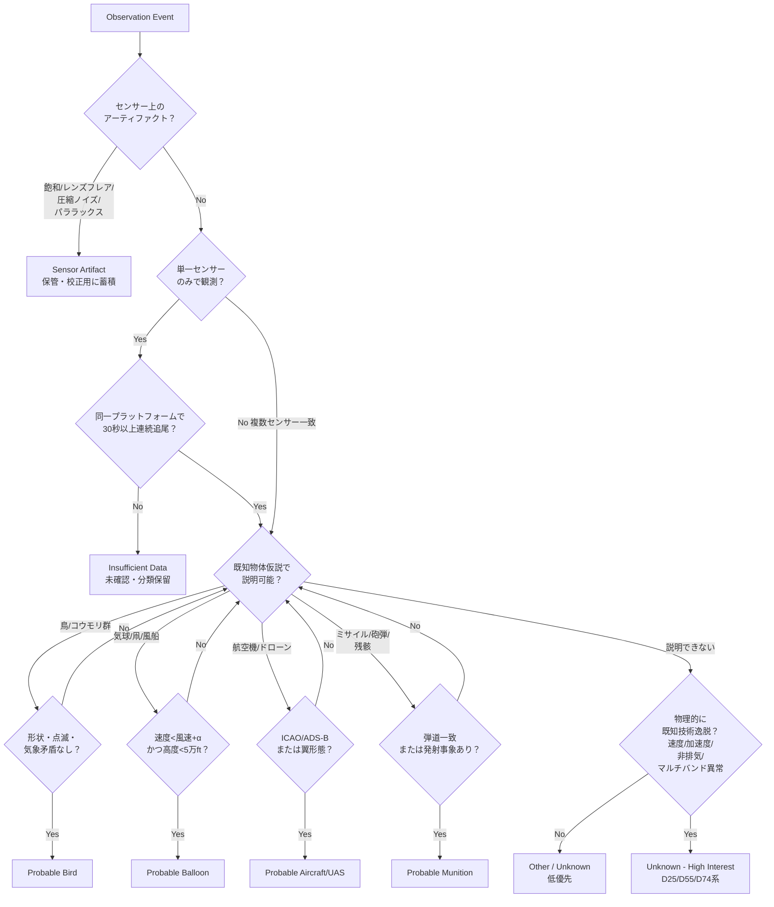

# 運用向け判定フロー（UAP Triage）

目的：観測イベントを **暫定分類**まで一定手順で落とすための運用フロー。
原則：**既知で説明できるなら未知に格上げしない**。多センサー一致と再現性を最優先。

## フロー図

## 多クラス分類ラベル（CSV列 `candidate_class` と一致）

| ラベル | 意味 | 対応エスカレーション |
|---|---|---|
| `sensor_artifact` | センサー由来。物体ではない。 | 校正DBへ |
| `probable_bird` | 鳥/虫の群れと整合 | 閉じる |
| `probable_balloon` | 自由/係留気球と整合 | FAA/NOTAM突合 |
| `probable_aircraft` | 有人機/UASと整合 | ADS-B / 飛行計画突合 |
| `probable_missile` | 弾道/発射事象と整合 | 戦域指揮所へ |
| `unknown` | 既知仮説に明確に当てはまらず情報不足 | データ収集継続 |
| `unknown_high_interest` | 既知技術で説明困難な物理特性あり | エスカレーション・元データ保全 |

## 判定上のガード（必須チェック）

1. **アーティファクト除外を必ず先に**: D28（兵器試射後IR熱源）、D32（FMV白色グレア）はアーティファクト疑いを優先処理しないと未知分類が水増しされる。
2. **多センサー一致が無ければ "unknown_high_interest" に上げない**: D25のSWIR単独観測は重要だが、別波長/別機体でのクロスバリデーションが揃うまで `unknown` 止まり。
3. **速度・距離はパッシブ単センサーでは確定しない**: 角速度→絶対速度の換算は仮定距離に依存。レンジング根拠が無ければ confidence を下げる。
4. **地理偏在 = 母数バイアス**: ホルムズ/アデン/エーゲのクラスタは「ISRが向いている場所」。発生分布として論じてはならない。
5. **既知識別後の戻し**: `probable_*` 確定後に新事実が出たら `unknown` に**戻せる**運用ログを残す（一方通行にしない）。

## 最低限のセンサー要件（運用標準として）

| 項目 | 要件 | 根拠 |
|---|---|---|
| 多波長 | VIS + MWIR + **SWIR** 同時 | D25でSWIR単独検出が起きている |
| 連続追尾 | ≥30秒 | D20の20秒喪失より長い母数を確保 |
| レンジング | パッシブステレオ or レーダー併用 | 速度推定の確度確保 |
| メタデータ | 自機姿勢・レンズ温度・露出・GAINを毎フレーム記録 | アーティファクト後解析の前提 |
| 校正 | 月次のフレア/グレア再現テスト | D28/D32型誤認の継続的キャリブレーション |
